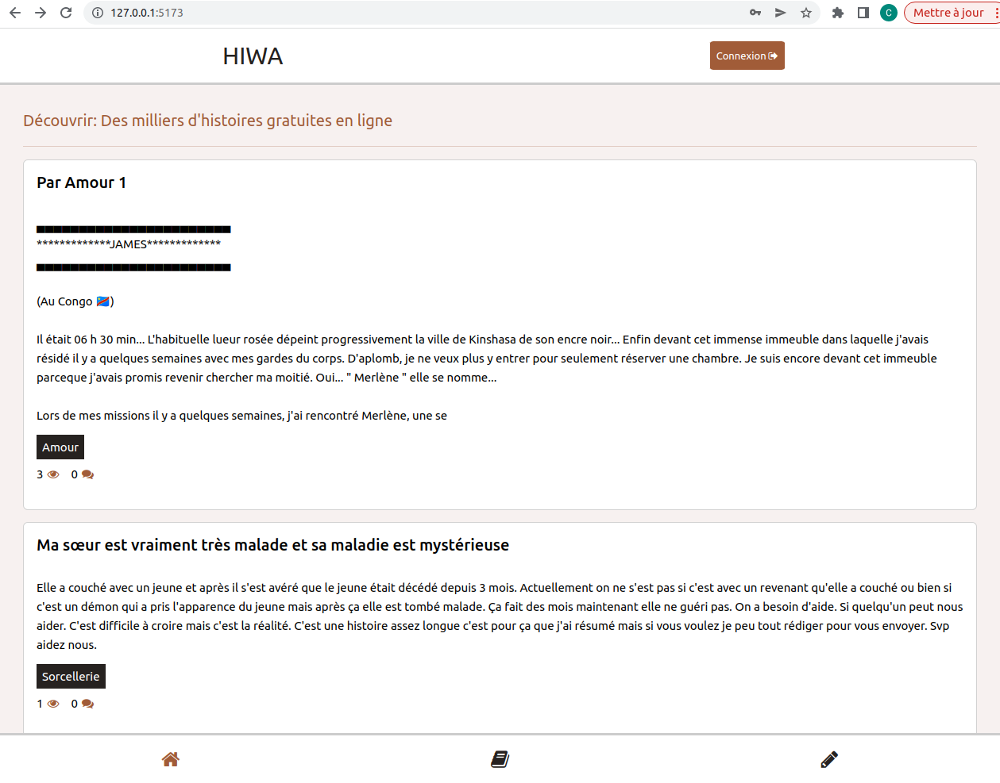
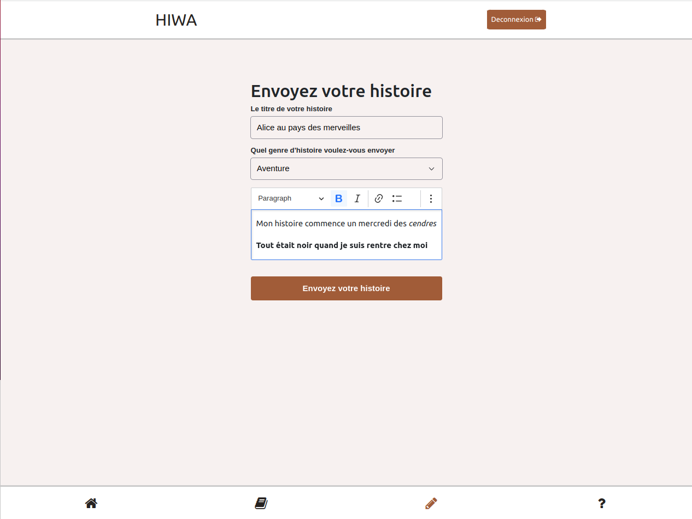
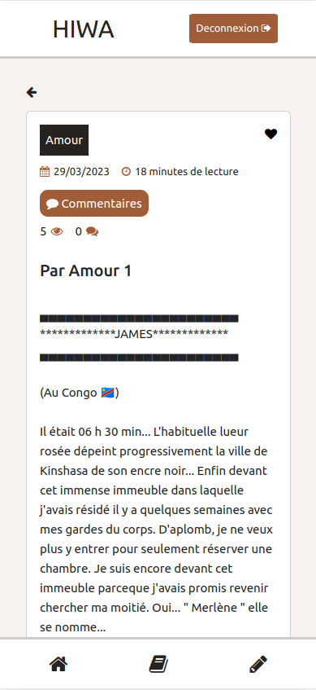
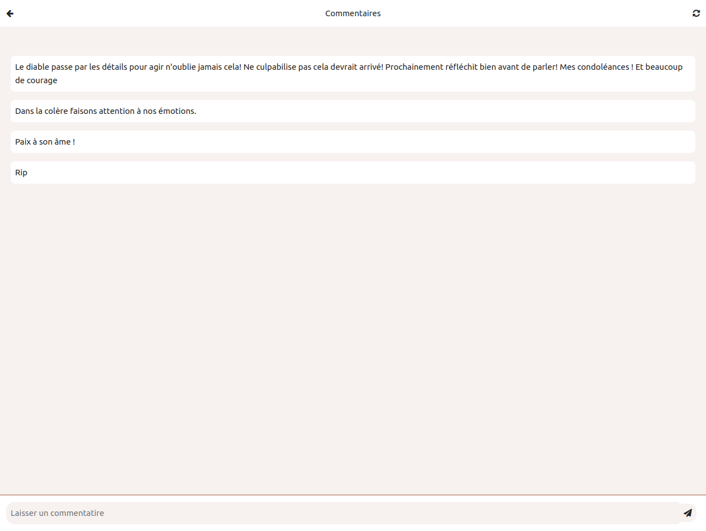
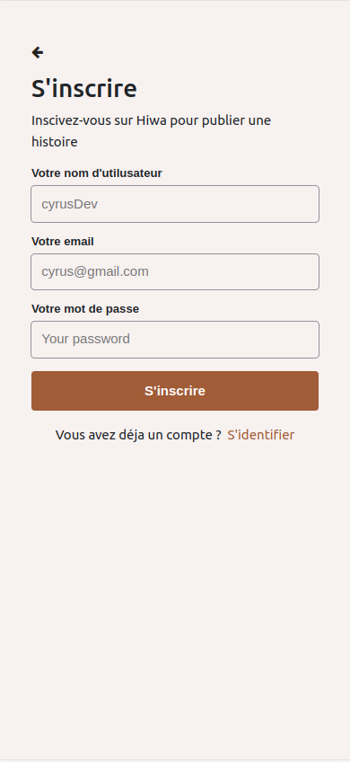

# Hiwa ~ Tell us your story anonymously

# Introduction

## The Project
HIWA is a web application on which you can tell your story with complete discretion. these stories can be lived stories, imaginary stories and others. You can also enable the comment option or disable it at any time. These comments are written by people who have read your story. In these comments you can for example receive advice and other.

## The Context
This project is my Portfolio Project, concluding my  Year at Holberton School and ALX. We were able to choose who we wanted to work with and what we wanted to work on, as long as we present a working program at the end of the two weeks of development.

# Peview
Here is a little preview of our main feature,

# Architecture

## Overview
My  web app is a single-page app, coded mainly in Javascript.

## Vue.js
For this project, i decided to focus on learning a new front-end framework. Following the advice of mentors and professionals, we chose to learn and use Vue.js. Then the whole frontend is based on vuejs.

## Node Js / Express Js
I decided to create the backend routes with Express because that's what we saw at cold, I wanted to deepen.

# Acknowledgments

* Holberton School and ALX staff - For the help, advice and resources they provided us with during this project and during all our curriculum.

* Cohort 5 and all Holberton and ALX students - For your friendship, invaluable support, and insight not only for this project, but over the last year.

* YOU - For reading this documentation

# License

MIT License

